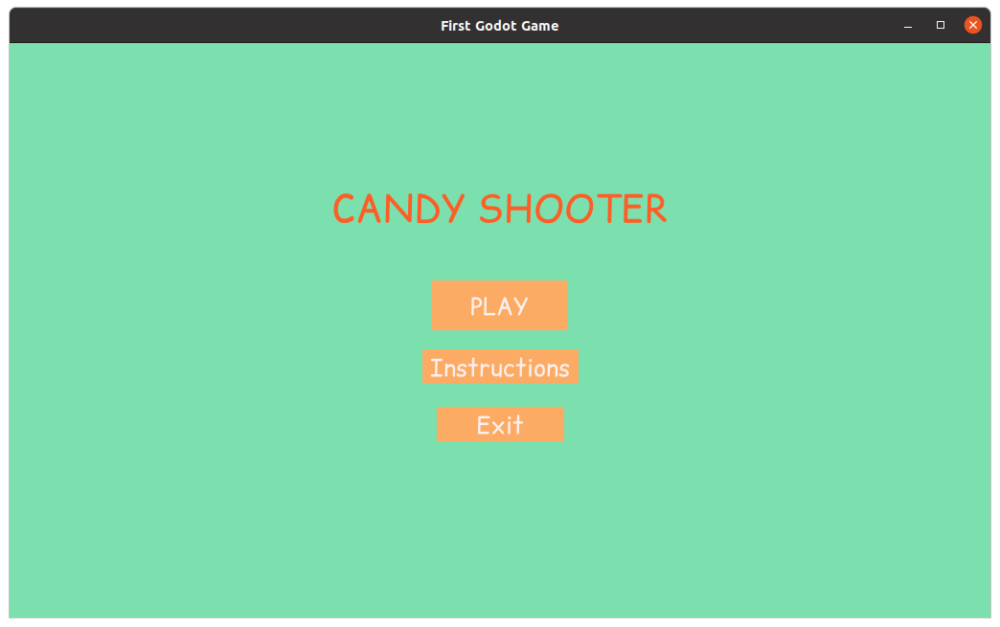
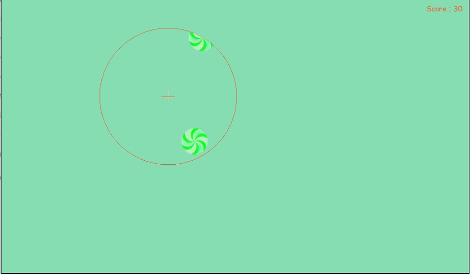
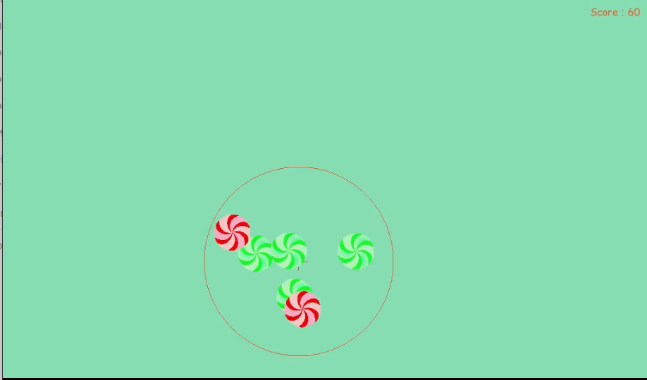
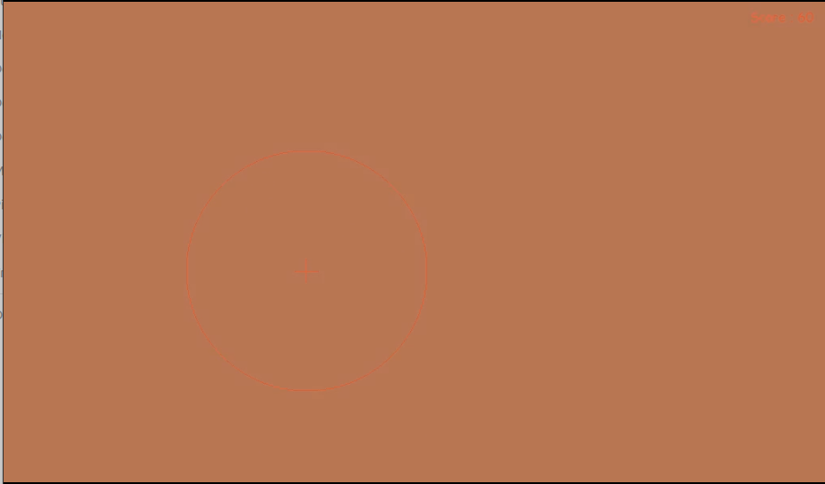
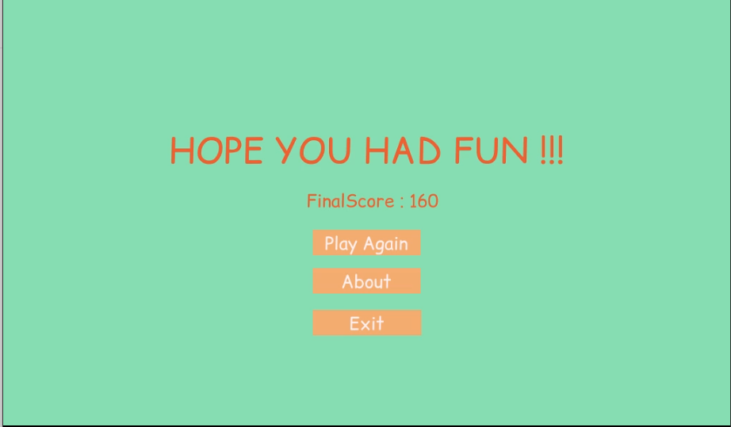

# Candy Shooter

This is my First Godot Game.

## About

This is the first game I made with Godot Game engine.
This is not a much interesting game, but is my first attempt at making games.
The candies are designed using Inkscape.

## Warning

The screen flashes from green to red when red candy is hit. This may potentially trigger seizures for people with photosensitive epilepsy. Player discretion is advised.

## Instructions

Click on the candy to shoot it.
Each green candy will give 10 points.
Each red candy will take away 10 points.
If you click red candy when points are zero, the game ends.
The First level is of 30 seconds and second level is of 60 seconds.
You can only view the candies that are in view range marked by the circle, and it will get smaller with time.
Hope you have fun...(that said its not that mush interesting...).

## Build instructions

The game was built in godot and all resources are in the repository.
The build folder contains Compiled versions for Linux/X11 and Windows OS, Which <small>(hypothetically)</small> should work out of the box.
Run the game.x86_64 (for Linux/X11) or game.exe (for Windows) file to start the game.

## Screenshots

Start Screen :

Level 1 :

Level 2 :

Red flash :

End Screen :

